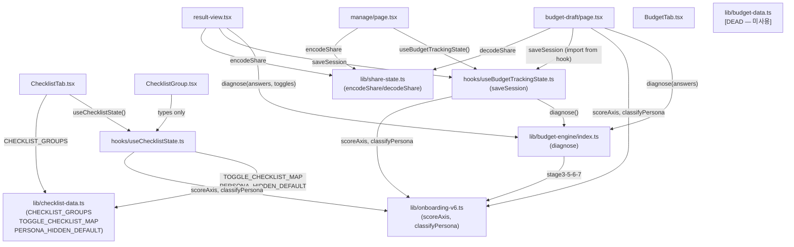

# Refactor Assessment — budgetroad
> 작성일: 2026-06-05  코드 변경 없음, 분석 전용

---

## 1. 큰 파일 / 책임 과다

| 파일 | 라인 | 심볼(함수·컴포넌트) 수 | 책임 추정 |
|---|---|---|---|
| `src/components/result/result-view.tsx` | 445 | 15개 함수 + 3개 useEffect | **3중 책임**: UI 렌더링 + 계측(스크롤·탭·이탈) + 공유/PDF/이미지 액션 |
| `src/lib/checklist-data.ts` | 335 | 타입 6개 + 상수 3개 | 정적 데이터 파일. 분리는 불필요하지만 335줄은 검토 대상 |
| `src/lib/budget-data.ts` | 321 | 타입 10개 + 상수 15개 + 함수 2개 | **죽은 코드**: 어떤 파일에서도 import되지 않음 (아래 §3 참조) |
| `src/app/page.tsx` | 321 | 컴포넌트 2개 | 랜딩 정적 마케팅 페이지. 책임 단일, 큰 문제 없음 |
| `src/app/budget-draft/page.tsx` | 350 | 함수 10개 + useEffect 3개 | **2중 책임**: 온보딩 상태기계 + 계측 (QuestionView를 파일내 분리는 함) |
| `src/components/manage/checklist/ChecklistGroup.tsx` | 297 | 함수 11개 + DnD 컨텍스트 | **3중 책임**: 아코디언 UI + 드래그 정렬 + 추가/삭제 편집 모드 |
| `src/hooks/useBudgetTrackingState.ts` | 220 | 5개 함수 + buildItems | **2중 책임**: 예산 항목 빌드(buildItems) + localStorage CRUD 상태 관리 |

### result-view.tsx 상세
`ResultView` 단일 컴포넌트 내부에 다음이 모두 존재한다:
- 탭 내비게이션 렌더
- 공유 모달 (바텀시트) 렌더
- 만족도 설문 모달 트리거
- 이미지 캡처·다운로드 (`runFullCapture`)
- PDF 인쇄 포털
- 스크롤 depth 계측 (`onScroll`, 25/50/80/100% 마일스톤)
- 탭 이탈·체류 계측 (`fireExit`, `dwellRef`)
- 세션 자동 저장 (`autoSaveRef`)

---

## 2. 중복 코드 · 복붙 패턴

### 2-a. `budgetroad_manage_session` 키 리터럴 5곳 분산
동일 localStorage 키가 상수화 없이 직접 문자열로 5개 파일에 분산돼 있다:

| 파일 | 라인 | 형태 |
|---|---|---|
| `src/hooks/useChecklistState.ts` | 10 | `const SESSION_KEY = 'budgetroad_manage_session'` |
| `src/hooks/useBudgetTrackingState.ts` | 10 | `const SESSION_KEY = 'budgetroad_manage_session'` |
| `src/app/cta-link.tsx` | 7 | `const MANAGE_SESSION_KEY = 'budgetroad_manage_session'` |
| `src/app/budget-draft/page.tsx` | 93 | 인라인 리터럴 `'budgetroad_manage_session'` |
| `src/app/budget-draft/page.tsx` | 209 | 인라인 리터럴 `'budgetroad_manage_session'` |
| `src/components/result/result-view.tsx` | 68 | 인라인 리터럴 `'budgetroad_manage_session'` |

→ 공통 `STORAGE_KEYS` 모듈이 없어 키 오타 시 런타임에서만 탐지된다.

### 2-b. `M5_REGION_MAP` 이중 정의
`onboarding-v6.ts:262`에서 `'지방'` 값으로 export되고,  
`stage3-variables.ts:11`에서 `'이외'` 값으로 로컬 재정의된다.  
두 맵의 D값이 다르며(`지방` vs `이외`) onboarding-v6의 export는 stage3에서 사용되지 않는다. `지방` 표기는 UI용, `이외` 표기는 엔진 내부용으로 의도적 분리로 보이지만 주석 없이 혼재해 혼란 유발.

### 2-c. LocalStorage 패턴 중복 (42회)
`useChecklistState.ts` 16회, `useBudgetTrackingState.ts` 14회, 기타 파일에도 분산.  
try/catch + getItem/setItem + JSON.parse/stringify 패턴이 반복된다.  
공통 `safeLocalStorage` 유틸이 없어 모든 파일에서 동일한 try/catch 보일러플레이트.

### 2-d. 공유 모달 바텀시트 중복
`result-view.tsx:375-417`과 `manage/page.tsx:90-122`에 거의 동일한 바텀시트 구조가 존재한다:
- `fixed inset-0 z-40 flex items-end bg-black/40` 오버레이
- `w-full rounded-t-3xl bg-white p-6` 시트 컨테이너
- "닫기" 버튼

현재 텍스트/옵션만 다를 뿐 HTML 골격은 동일하다.

### 2-e. 토스트 로직 중복
`manage/page.tsx:21-24`와 `result-view.tsx:202-205`에 동일한 `showToast` + 2초 타임아웃 패턴.  
`result/ui/toast.tsx` 컴포넌트는 있지만 state 관리는 두 파일에서 각자 구현.

### 2-f. `enabledToggleLines` vs `buildItems` 내 toggles 순회 중복
`tab-itemized.tsx:enabledToggleLines`와 `useBudgetTrackingState.ts:buildItems`가 모두  
`TOGGLES_META`를 순회하며 `TOGGLE_PRICES[id][region][season]`을 직접 읽는다.  
이 계산은 이미 `stage5-budget`이 수행한 결과를 `ResultPayload.budget`에 담고 있는데도,  
프레젠테이션 레이어가 raw 가격 테이블을 재참조한다.

---

## 3. 죽은 코드 · 안 쓰는 export

### 3-a. `src/lib/budget-data.ts` — 전체 파일 사용 안 함 (321줄)
`from '@/lib/budget-data'` import가 codebase 어디에도 없다.  
이 파일은 v1~v5 온보딩용 선택형 예산 계산기의 잔재로 추정된다.

내부 export 목록:
- `Region`, `VenueType`, `Season`, `Tier`, `GuestCount`, `MealCost`, `YemulTier`, `HoneymoonChoice` (타입)
- `StepSelections`, `BudgetResultItem`, `BudgetResult` (인터페이스)
- `DEFAULT_SELECTIONS`, `REGION_OPTIONS`, `VENUE_OPTIONS`, `SEASON_OPTIONS`, `TIER_LABELS`, `STUDIO_TIER_OPTIONS`, `DRESS_TIER_OPTIONS`, `MAKEUP_TIER_OPTIONS`, `GUEST_OPTIONS`, `MEAL_OPTIONS`, `YEMUL_OPTIONS`, `HONEYMOON_OPTIONS`, `STANDARD_MEAL_PRICES` (상수)
- `isVenueDisabled`, `calculateBudget` (함수)

### 3-b. `PERSONA_DESCRIPTIONS` (onboarding-v6.ts:228) — 사용처 없음
export는 됐지만 src 전체에서 단 한 번도 import되지 않는다.

### 3-c. `M5_REGION_MAP` (onboarding-v6.ts:262) — 사용처 없음
`stage3-variables.ts`가 자체 로컬 버전으로 재정의하므로 onboarding-v6의 export는 사용되지 않는다.

### 3-d. `LEGACY_STORAGE_KEY` (budget-draft/page.tsx:28)
`'budgetroad_result'`를 두 군데서(`sessionStorage.removeItem` + `cta-link.tsx:28`)만 삭제하는 목적으로만 쓴다.  
정리용 잔재 상수. 기록 목적으로 남기려면 주석 추가 필요.

### 3-e. DnD 드래그(dnd-kit) — `ChecklistGroup.tsx`만 사용
`useSortable`, `DndContext`, `SortableContext`, `arrayMove` 등이 `ChecklistGroup.tsx` 한 파일에만 사용된다. 죽은 코드는 아니나 향후 제거 시 번들 크기에 유의.

---

## 4. 타입 구멍

| 파일 | 라인 | 패턴 | 심각도 |
|---|---|---|---|
| `src/lib/db.ts` | 3 | `globalThis as unknown as { prisma: ... }` | 낮음 — Next.js 핫리로드 패턴으로 관용적 사용 |
| `src/app/api/events/route.ts` | 27 | `const err = e as { code?: string; meta?: unknown }` | 낮음 — catch 블록에서 Prisma 에러 narrowing 목적, 구조적으로 안전 |
| `src/hooks/useBudgetTrackingState.ts` | 108 | 3항 연산자로 `category` 문자열 매핑 (`c.filterCategory === 'venue' ? '예식장' : c.filterCategory === 'studio' ? '스드메' : '기타'`) | 중간 — `'dress'` / `'makeup'` 케이스가 전부 `'기타'`로 덮여 잠재적 버그 |
| 전체 | - | `as any` 없음 — 0건 | - |
| 전체 | - | `@ts-ignore` / `@ts-expect-error` 없음 — 0건 | - |

### 타입 구멍 §4 상세: useBudgetTrackingState.ts:108
`buildItems` 내 커스텀 항목 복원 시 `category` 필드를 다음 로직으로 결정한다:

```typescript
category: c.filterCategory === 'venue' ? '예식장'
        : c.filterCategory === 'studio' ? '스드메'
        : '기타',
```

`'dress'`·`'makeup'`·`'other'` 세 케이스가 모두 `'기타'`로 처리되지만,  
addCustomItem(line 170)에서는 `'studio'` → `'스드메'`, `'other'` → `'기타'`로만 변환하고  
`'dress'` / `'makeup'`은 역시 `'기타'`로 떨어진다.  
이 불일치는 커스텀 항목이 드레스·메이크업 카테고리로 추가되면 표시 카테고리가 틀린다.

---

## 5. 일관성 이슈

### 5-a. 파일명 케이싱 혼용
- `src/components/manage/checklist/` — `ChecklistGroup.tsx`, `ChecklistItem.tsx`, `ChecklistTab.tsx` (PascalCase)
- `src/components/result/tabs/` — `tab-comprehensive.tsx`, `tab-itemized.tsx`, `tab-care.tsx` (kebab-case)
- `src/components/result/` — `result-view.tsx`, `loading-view.tsx`, `footer.tsx` (kebab-case)
- `src/components/manage/budget/` — `BudgetTab.tsx`, `BudgetItemCard.tsx` (PascalCase)
- 동일 레벨 내에서도 케이싱이 혼재한다.

### 5-b. 상태 관리 패턴 혼용
- `useState` 직접: 모든 컴포넌트
- Context 없음
- Zustand 없음  
→ 상태 공유는 props drilling 또는 localStorage pass-through로만 이루어진다.  
특히 `ChecklistTab → ChecklistGroup`으로 11개 props가 전달된다 (과다한 prop drilling).

### 5-c. `min-h-screen` vs `min-h-dvh` 혼용
- `budget-draft/page.tsx:223` — `min-h-dvh` (모바일 동적 뷰포트 대응)
- `manage/page.tsx:45` — `min-h-screen` (구형 표기)
- `loading-view.tsx:43` — `min-h-dvh`

### 5-d. export 방식 혼용
- `src/app/page.tsx`, `src/app/budget-draft/page.tsx`, `src/app/manage/page.tsx` — `export default function`
- 컴포넌트 대부분 — `export function` (named)
- App Router 규약(page.tsx는 default)은 지켜지나, 같은 파일 내 인라인 컴포넌트(`QuestionView`는 named, 페이지는 default)가 혼재한다.

### 5-e. Prisma API Route — 단일 파일, 패턴 일관
`src/app/api/events/route.ts` 40줄. POST 단일 엔드포인트, Prisma 직접 호출. 현재는 단순해서 패턴 이슈 없음.

---

## 6. 의존 그래프



### 핵심 의존 서술

**a) `useChecklistState`**: `ChecklistTab.tsx` 단독 호출. `ChecklistGroup.tsx`는 hook 결과를 props로만 받는다(타입만 import). 구조 명확.

**b) `CHECKLIST_GROUPS`**: `ChecklistTab.tsx`에서만 사용. 단방향, 문제 없음.

**c) `TOGGLE_CHECKLIST_MAP`**: `useChecklistState.ts`에서만 소비. 단방향.

**d) `userItems` 패턴**: `useChecklistState`의 state `userItems`가 `ChecklistTab → ChecklistGroup`으로 props로 전달된다. 그룹 내 로컬 state(`adding`, `newText`, `localOrder`)는 `ChecklistGroup`이 소유. 2단 props drilling이지만 추가 레이어는 없다.

**e) `diagnose` 호출 경로**: 4곳에서 호출됨.
- `result-view.tsx:63` — 초기 디폴트 토글 산출 (`useMemo`)
- `result-view.tsx:78` — 토글 변경 시 재진단 (`useMemo`)
- `budget-draft/page.tsx:158` — 이벤트 payload 안에 `total_budget` 추출 (onloadingComplete 아님, `buildResultPayload` 내 1회)
- `useBudgetTrackingState.ts:96` — 세션 복원 시 `buildItems`용

**f) `prisma`**: `src/app/api/events/route.ts`에서만 사용. `src/lib/db.ts`에서 싱글톤 export.

---

## 7. Next 16 진단 분류

LSP hover/diagnostics 수집 결과 (code 71007는 "Props have function types" 경고):

| 파일 | 위치 | 코드 | 경고 내용 | 분류 | 이유 |
|---|---|---|---|---|---|
| `result-view.tsx` | line 38 `onReset` prop | [71007] | `onReset: () => void` — 함수 prop을 Server Component에서 넘길 수 없음 | **(c) 무시 가능** | `result-view.tsx`는 `'use client'`이고, 부모 `budget-draft/page.tsx`도 `'use client'`. 클라↔클라 경계라 문제 없음. |
| `result-view.tsx` | line 434-435 `setToggle={() => {}}` | 주의 | PDF 포털 내 TabCare에 no-op 함수 prop 전달 | **(c) 무시 가능** | 의도적 no-op (PDF 렌더 전용, 상호작용 없음). 주석 있음. |
| `ChecklistGroup.tsx` | line 27 `onToggle` | [71007] | `onToggle: (id, checked) => void` — 함수 prop | **(c) 무시 가능** | 부모 `ChecklistTab.tsx`도 `'use client'`. 클라↔클라 경계. |
| `ChecklistGroup.tsx` | line 32 `onAddUserItem` | [71007] | `onAddUserItem: (groupId, text) => void` — 함수 prop | **(c) 무시 가능** | 동상. |
| `ChecklistGroup.tsx` | line 33 `onRemoveUserItem` | [71007] | `onRemoveUserItem: (id) => void` — 함수 prop | **(c) 무시 가능** | 동상. |
| `ChecklistGroup.tsx` | line 35 `onHideItem` | [71007] | `onHideItem: (id) => void` — 함수 prop | **(c) 무시 가능** | 동상. |

### `'use client'` 파일 전체 (25개)

모든 `'use client'` 파일은 부모도 클라이언트 컴포넌트거나 App Router 페이지이며,  
서버 컴포넌트에서 클라이언트 훅을 사용하는 경우는 발견되지 않았다.

서버 컴포넌트: `src/app/layout.tsx`, `src/app/page.tsx` (TrackPageEnter는 클라이언트이나 동적 렌더 외부에 배치됨).

`'use server'` 선언 파일: **0개** — Server Action 미사용. 이벤트 전송은 클라이언트가 직접 `POST /api/events`를 호출한다.

---

## 8. 리팩토링 후보 우선순위 표

| # | 후보 | 위험도 (1-5) | 효과 (1-5) | 점수 | 설명 |
|---|---|---|---|---|---|
| 1 | **`budget-data.ts` 삭제** | 1 | 5 | **5** | 전체 파일이 사용되지 않음. 321줄 제거로 빌드 번들 감소, onboarding-v6와 타입명 충돌 해소 (`Region`, `VenueType`, `BudgetResult` 등이 두 파일에 중복 정의됨). 삭제 전 grep으로 최종 확인만 하면 된다. |
| 2 | **localStorage 키 중앙화 (`STORAGE_KEYS` 모듈)** | 1 | 4 | **4** | `budgetroad_manage_session` 등 6개 키가 5개 파일에 흩어짐. `src/lib/storage-keys.ts` 하나에 모으면 오타·키 변경 시 안전. |
| 3 | **`result-view.tsx` 계측 로직 분리** | 2 | 4 | **8** | 스크롤 depth·탭 체류·이탈 이벤트 로직을 `useResultTracking(persona)` 커스텀 훅으로 추출. 약 70줄을 파일에서 분리해 ResultView를 UI 중심으로 단순화. |
| 4 | **`PERSONA_DESCRIPTIONS` 및 `M5_REGION_MAP` (onboarding-v6) 삭제 또는 주석 정리** | 1 | 3 | **3** | 사용되지 않는 export 제거. `M5_REGION_MAP`의 `지방` vs `이외` 불일치는 버그 혼란 유발 가능. |
| 5 | **공유 바텀시트 컴포넌트 추출** | 2 | 3 | **6** | `result-view.tsx`와 `manage/page.tsx`에 동일 패턴이 복붙됨. `<ShareBottomSheet>` 공통 컴포넌트화. |
| 6 | **`useBudgetTrackingState.ts:108` `category` 매핑 버그 수정** | 2 | 4 | **8** | `dress`·`makeup` filterCategory가 커스텀 항목에서 `'기타'`로 잘못 표시됨. switch/Record 매핑으로 수정. 위험도 낮지만 데이터 정확성 영향. |
| 7 | **`ChecklistGroup` 책임 분리** | 3 | 3 | **9** | 아코디언 + DnD 정렬 + 편집 모드가 297줄에 혼재. 편집 모드만 `ChecklistEditMode`로 분리. DnD 관련은 `SortableRow`가 이미 분리돼 있어 절반은 완료. |
| 8 | **`buildItems` 로직을 `budget-engine`으로 이동** | 3 | 3 | **9** | `useBudgetTrackingState.ts:buildItems`가 `ResultPayload` + `TOGGLES_META` + `TOGGLE_PRICES`를 직접 소비. 이 계산은 이미 엔진이 수행한 것을 다시 분해한다. `ResultPayload`에 `managementItems` 필드를 추가하거나, 엔진 내 헬퍼 함수로 이동하면 tab-itemized.tsx의 `enabledToggleLines`도 통합 가능. |
| 9 | **`showToast` 커스텀 훅 추출** | 1 | 2 | **2** | `result-view.tsx`와 `manage/page.tsx`에 동일 패턴. `useToast()` 훅 또는 Toast 컴포넌트에 state 포함 방식으로 단순화. |
| 10 | **파일명 케이싱 통일** | 1 | 2 | **2** | `manage/checklist/` PascalCase, `result/tabs/` kebab-case 혼용. kebab-case로 통일 권장(Next.js 파일 관례). 순수 리네임이라 로직 변경 없음. |

### 점수 상위 3개 요약

1. **#7 ChecklistGroup 책임 분리 + #8 buildItems 이동 (점수 9)** — 버그 위험 없이 유지보수성 가장 크게 향상.
2. **#3 result-view 계측 훅 분리 (점수 8) + #6 category 매핑 버그 (점수 8)** — #6은 버그이므로 우선 수정 권장.
3. **#1 budget-data.ts 삭제 (점수 5)** — 위험도 최저, 효과 즉각적.
